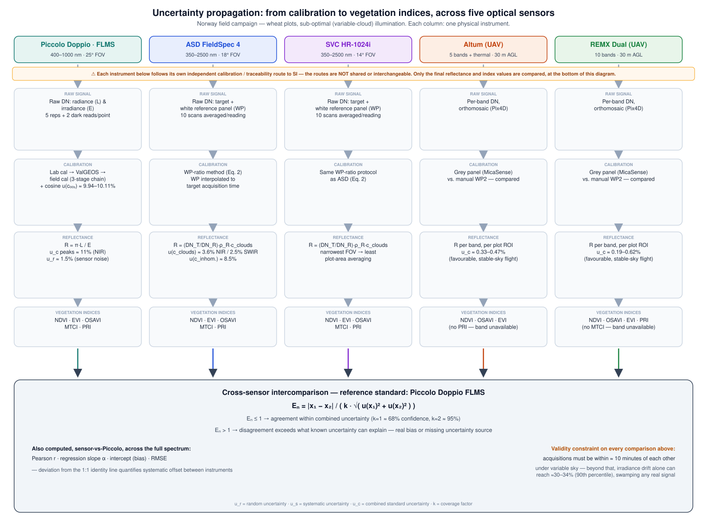

# Case: cross-sensor intercomparison and agreement

The three cases in this section ([Piccolo Doppio](case-piccolo.md),
[ASD & SVC](case-asd-svc.md), [UAV sensors](case-uav.md)) each derive
reflectance and vegetation indices their own way, under the same real
constraint: the 2025 Norway field campaign was carried out under sub-optimal,
variable-cloud illumination, not the stable clear-sky conditions every
calibration method quietly assumes. This case is about the final question all
three lead to: **given that every instrument's uncertainty budget is honest,
can their measurements still be meaningfully compared?**

The diagram below shows how uncertainty flows from calibration to indices for
all five instruments, converging on that question.

!!! note "Reference"
    Findings referenced throughout are from Werfeli, Mihai *et al.* (in
    review), *"Uncertainty propagation and intercomparison of multi-sensor
    measurements of vegetation stress in sub-optimal conditions."*

!!! tip "Not just for this dataset"
    The EN-ratio comparison method shown here applies to **any
    two independent instruments** measuring the same target, not only the
    sensors in this campaign. The 2025 Norway data is a concrete worked
    example; the code is written to run on your own paired measurements and
    their own uncertainty budgets in the same way.

## The comparisons actually run

Rather than one blanket "do the sensors agree?" question, the real analysis
runs several distinct, targeted comparisons — each isolating one specific
source of disagreement:

| Comparison | Isolates |
|---|---|
| ASD vs. SVC | Two independent instruments, same method (white-panel ratio), same field of view class → tests instrument-to-instrument agreement when the *method* is held constant. [Try it yourself](https://github.com/Lauramihai15/PANGEOS-UncertaintyPropagation/blob/main/notebooks/case_intercomparison-Ex1_ASD_vs_SVC.ipynb) with real Plot 103 data, including real acquisition timestamps parsed directly from the SVC instrument files. |
| Piccolo FLMS vs. Piccolo QEP | Two detectors on the *same* physical system → tests internal consistency of one instrument, not cross-instrument agreement |
| Altum / REMX vs. Piccolo FLMS | UAV vs. ground point measurement → tests agreement across completely different spatial footprints and calibration methods |
| Altum / REMX vs. Piccolo QEP | Same, against the second Piccolo detector |

Each comparison is repeated for both white reference panels used in the
ground campaign (labelled WP1 and WP2 in this training material), since the
panel itself carries its own calibration uncertainty and is part of what
could cause two instruments to disagree. This is not a minor detail: for
ASD vs. SVC at Plot 103, agreement is ~92% of wavelengths (k=1) when both
instruments are referenced to WP1, but only ~54% when both are referenced to
WP2 instead — the *same two instruments*, the same targets, only the
reference panel changed. See the notebook linked above for the full
comparison.

## Why each sensor still needs its own honest budget first

The EN ratio (the normalised error, defined below) only needs each
sensor's **final value and its own combined uncertainty** — it does not care
how that uncertainty was built up internally, which is exactly why
[Piccolo](case-piccolo.md), [ASD/SVC](case-asd-svc.md), and
[UAV](case-uav.md) are allowed to follow completely different calibration
routes. But it does mean the comparison is only as trustworthy as the
least-complete uncertainty budget feeding into it: if one sensor's budget is
missing a real source of error, its EN values will look better than
they should, not worse — an easy way to be fooled into false agreement.

$$E_N = \frac{|x_1 - x_2|}{k\sqrt{u(x_1)^2 + u(x_2)^2}}$$

- EN ≤ 1 (at k=1, ~68% confidence, or k=2, ~95%) → the disagreement
  is fully explained by the two sensors' own uncertainty.
- EN > 1 → something is happening that neither sensor's budget
  accounts for.

## What sub-optimal conditions do to the comparison, specifically

Two effects of the variable-cloud conditions during this campaign feed
directly into these EN comparisons, and both work in the same
direction — inflating disagreement between instruments that would otherwise
agree:

- **Changing cloud cover** adds a shared, time-varying error to every
  ground-based reflectance measurement (quantified via the wavelength-pair
  panel regression described in [ASD & SVC](case-asd-svc.md#the-cloud-problem-and-how-it-was-measured)),
  and it does not affect every instrument identically if they were not
  reading at the exact same instant.
- **Acquisition timing** compounds this: instruments measured sequentially,
  not simultaneously, so a comparison between two instruments is really a
  comparison across a time gap during which illumination could have already
  shifted. This is why the 10-minute acquisition window (re-measuring the
  white panel at least every 10 minutes) matters — beyond it, apparent
  disagreement is dominated by illumination drift, not by anything the
  instruments themselves did differently.

The practical consequence: an EN comparison run on data from this
kind of campaign has to treat "were these two readings taken close enough in
time under similar enough sky conditions" as a precondition to check *before*
trusting the EN value itself — a large EN can mean real
sensor disagreement, or it can mean the comparison was never valid to begin
with.

## Going further

- [Case: Piccolo Doppio](case-piccolo.md), [Case: ASD & SVC](case-asd-svc.md),
  [Case: UAV sensors](case-uav.md) — the three uncertainty budgets that feed
  into every comparison on this page.
