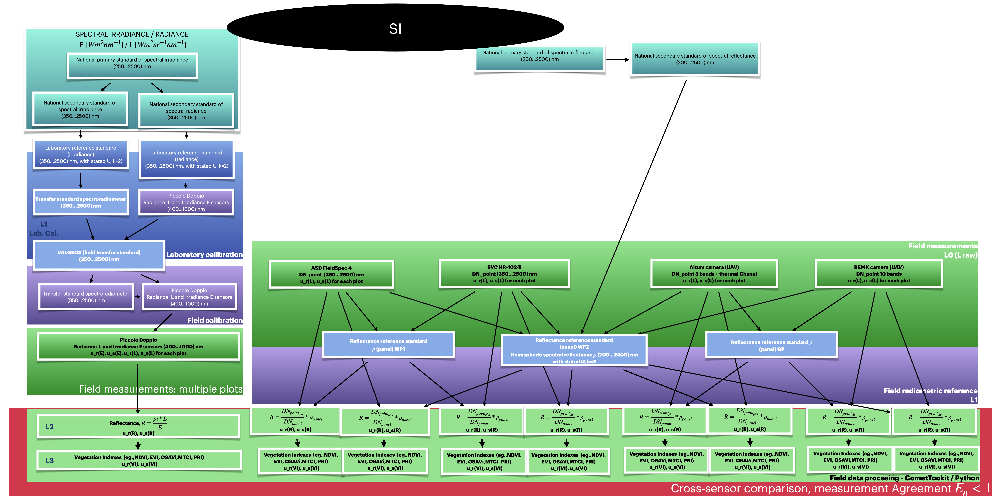

# Piccolo Doppio (FLMS/QEP) uncertainty propagation case

The [Case 1](https://github.com/pangeos-cost/uq-training/blob/main/notebooks/case_1-Ex0-Piccolo.ipynb)
notebooks teach the basics of uncertainty propagation for the Piccolo Doppio system using one clean, minimal example. This case study extends this case, using the same approach, to the full 2025 Norway field campaign: 12 wheat plots measured around solar noon under sub-optimal, variable cloud illumination. The same ideas are applied at full scale: two detectors (FLMS and QEP, from Ocean Insight, USA), a calibration chain, and five vegetation indices, all with random and systematic uncertainty tracked separately and propagated with `punpy` (CoMet toolkit).

This page focuses on what each stage produces and how uncertainty flows to the next. The runnable notebook below starts from the field calibration coefficients, which are the result of the calibration chain, and processes the field measurements of any plot of the campaign up to the vegetation indices, for readers who want to reproduce these steps on their own data.

> **Note:** This example can be applied to any similar device.
> The Piccolo Doppio system is one example of a broader instrument class:
> a **dual-fibre spectrometer built around Ocean Insight QE-series spectrometers**,
> with a cosine-diffuser fore-optic for irradiance and a collimator (or bare fibre) for radiance.
> The same measurement equation, calibration chain structure, and uncertainty propagation approach
> can be applied directly to other systems built in the same way, such as **FLOX** and similar custom dual-optic QE setups.
> The 2025 Norway data is used throughout as a concrete worked example so that the process is easy to follow;
> every step can be re-run on your own data by substituting your own files in the same format.

## Calibration chain

A spectrometer's raw output is not a physical quantity; it is a digital number (DN) that depends on the specific detector, its exposure time, its temperature, and how much it has drifted since it was last checked against a known reference (a standard). Before anything scientifically meaningful (radiance, irradiance, reflectance) can be computed, the DNs have to be traced back to a physical unit through an unbroken chain of comparisons against reference standards. This is what traceability means.

For the Piccolo Doppio this traceability chain (laboratory calibration, laboratory validation against a transfer standard and field validation) was carried out completely. Its steps are not presented in this material: users generally receive from the laboratory that performed the calibration only the calibration coefficients and their uncertainties, and these are the input of the notebook. If no field system is available to validate the calibration, the procedure is practically the same: the calibration coefficients received from the laboratory are used, together with their uncertainties.

## Outputs of the traceability chain

The calibration chain provides, per detector (FLMS and QEP) and per wavelength:
- a **calibrated value** (the calibration coefficient), and
- its **uncertainty, already split into a random component and a systematic component**, not a single combined number. The uncertainties from each previous step are propagated to the next one, so that at the end we obtain the required results with the total propagated uncertainty for the entire chain.

That split matters downstream: a random component shrinks when you average repeated measurements; a systematic (common) one does not. By the time the calibration coefficients are handed over, every
downstream calculation treats it as: *a value, a random uncertainty, and a systematic uncertainty*, three numbers (per wavelength) in, three numbers out, at every subsequent step.

How the uncertainty is propagated along the full pipeline can be seen in the diagram, on the left side:

 

and here:

```
field calibration → CalCoeffsL, CalCoeffsE, uL_random, uL_systematic, uE_random, uE_systematic
        │
        ▼
field measurement → calibrated radiance (L) and irradiance (E), (each with u_random, u_systematic)
        │                                    
        │
        │   + *cosine response uncertainty added to E's systematic component
        │    
        ▼
reflectance R = π·L/E        (u_random, u_systematic propagated through the ratio)
        │
        ├──► *plot level mean over 5 points
        │     (u_random shrinks by averaging + plot heterogeneity added back in;
        │      u_systematic does not shrink, see Eq. 3 in the paper)
        │
        ▼
vegetation indices (NDVI, EVI, OSAVI, MTCI, PRI)
        │     (each index's uncertainty combines the reflectance band
        │      uncertainties through that index's own formula, using a
        │      correlation matrix sized to how many bands it depends on)
        ▼
ready for cross-sensor comparison, see Case: cross-sensor intercomparison
```

At every arrow, uncertainty is propagated with the `punpy` functions from the CoMet toolkit (`propagate_random` / `propagate_systematic`, 10,000 samples) rather than carried forward as a single hand-derived formula. This is the same principle taught in Case 1, applied consistently through many more steps and to many more output quantities.

## Cosine correction

The irradiance sensor's cosine receptor deviates from the ideal cosine law. This deviation is applied as an *additional* systematic uncertainty on irradiance at the field-measurement step, sized per plot according to the solar zenith angle (9.94%, 9.66%, or 10.11% relative uncertainty, matching the paper's reported `u(ccos)` values), treated as a rectangular (uniform) distribution.

## Field measurements, per point
For each of the 5 measurement points per plot, the field calibrated radiance and irradiance are combined into reflectance, with the cosine response term folded in as described above. This is the direct, full scale counterpart of what Case 1 does for a single example point.

### Plot level mean over 5 points
The 5 per point spectra are combined into a plot mean in a way that does two things at once: it averages the random component down (more points → less random noise) and adds the point-to-point spread back in as an extra random term. This is what turns "5 repeated measurements" into the `u(c_inhomogeneity)` component from Eq. 3 of the paper. The systematic component is *not* reduced by averaging, because it affects every point in
the same way; only its mean is carried forward.

TRY IT YOURSELF:

[`CaseEx1_Piccolo_UncProp.ipynb`](https://github.com/Lauramihai15/PANGEOS-UncertaintyPropagation/blob/main/notebooks/CaseEx1_Piccolo_UncProp.ipynb)
starts from the field calibration coefficients (with their propagated random and systematic uncertainties), applies them to the raw field measurements to obtain the radiance and irradiance, and continues with the reflectance, the plot mean and the five vegetation indices, using real data (Plot 103 by default).
The detector (FLMS or QEP) and the plot are selected at the top of the notebook.

## Vegetation indices
At each point, **NDVI, EVI, OSAVI, MTCI, and PRI**, all five indices from the paper's Table 3, are computed with uncertainty propagated using a correlation matrix sized to the number of
reflectance bands each index depends on (2 bands or 3 bands), reflecting that those bands share correlated systematic errors from the same calibration chain.

## Running for other plots and detectors
The notebook processes one plot and one detector at a time. The plot (`PLOT_ID`) and the detector (`SENSOR`, FLMS or QEP) are selected at the top of the notebook; the same code runs for all 12 plots and for both detectors.
